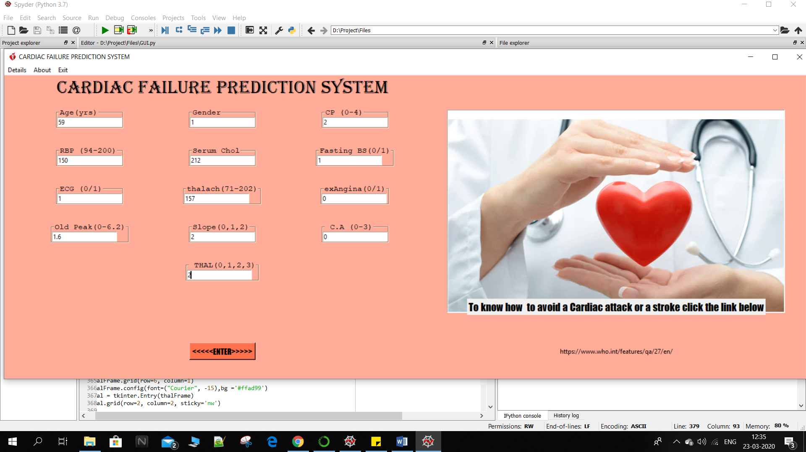
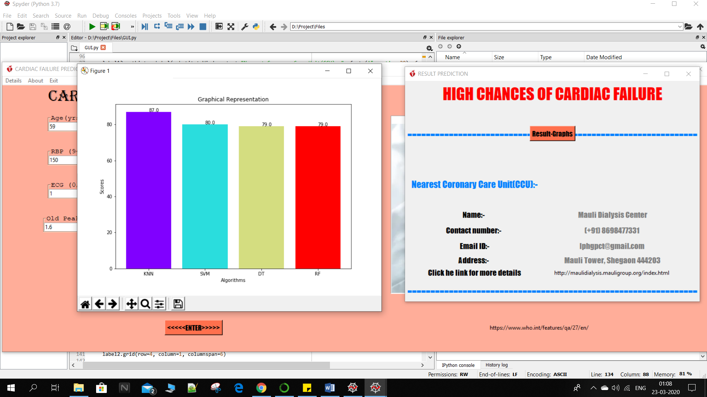

# Cardiac-failure-prediction-system-using-machine-learning
This is a final year project. We have developed such a system which is capable to predict the chances of cardiac failure .The project comes under the domain of ML.     

Software Requirement

1: Tkinter:-
            Tkinter commonly comes bundled with Python, using Tk and is Python's standard GUI
framework. It is famous for its simplicity and graphical user interface. It is open-source and
available under the Python License. Tkinter is a Python binding to the Tk GUI toolkit. Tk is the
original GUI library for the Tcl language. Tkinter is implemented as a Python wrapper around a
complete Tcl interpreter embedded in the Python interpreter. There are several other popular
Python GUI toolkits.

2: Anaconda Navigator:-
             Anaconda Navigator is a desktop graphical user interface (GUI) that allows you to launch
applications and easily manage conda packages, environments, and channels without using
command-line commands. Navigator can search for packages on Anaconda Cloud or in a
local Anaconda Repository. It is available for Windows, macOS, and Linux.

3: Spyder (Python IDE):-
            Spyder is an open source cross-platform integrated development environment (IDE) for scientific
programming in the Python language. Spyder integrates with a number of prominent packages in
the scientific Python stack, including NumPy, SciPy, Matplotlib, pandas, IPython, SymPy and
Cython, as well as other open source software. It is available cross-platform through Anaconda,
on Windows, on macOS through MacPorts, and on major Linux distributions such as Arch
Linux, Debian, Fedora, Gentoo Linux, openSUSE and Ubuntu. Spyder uses Qt for its GUI, and is
designed to use either of the PyQt or PySide Python bindings.

Hardware Requirement
1. CPU: 2 x 64-bit 2.8 GHz 8.00 GT/s CPUs
2. RAM: 4GB or more (DDR3 RAM).
3. Storage: 300 GB or more.

